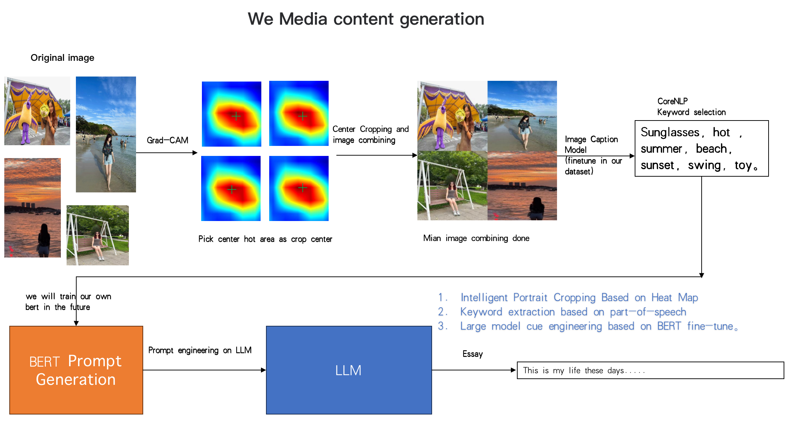
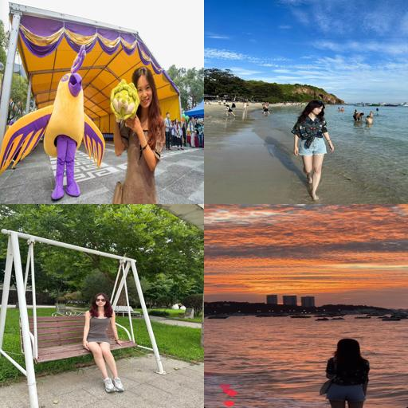

# We_media generator

## Dependencies
- python 3.8
- Pytorch 2.01
- opencv-python 4.8.0.76 
- spacy  3.6.1 

## Frame

**Data**

1. Select some photo and put them in input file
2. Run Main.py
3. Get the photo in output file
4. The girl in the workflow is my beautiful son

**Training**

The new bert will be updating soon

**Validation**

In image caption, we use clip to compute a similarity between image and word to control the keyword generating

**Examples**

Sentence: we will approve this soon